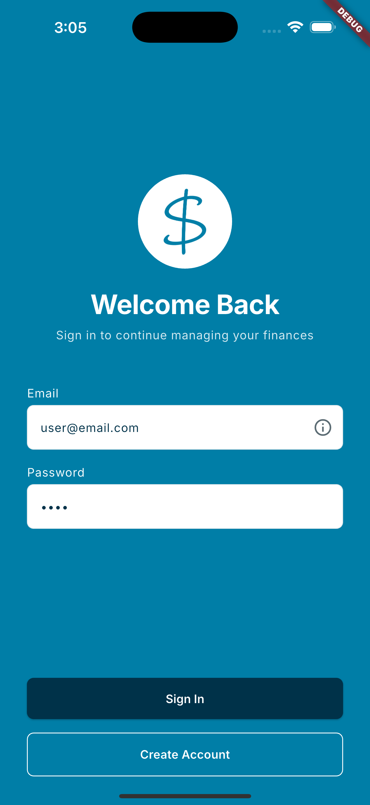
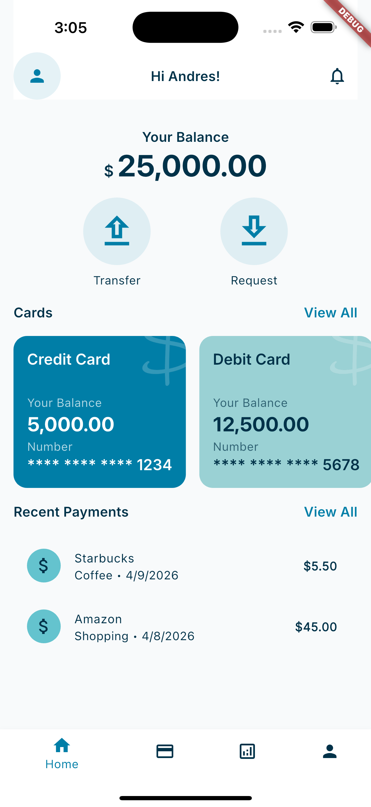
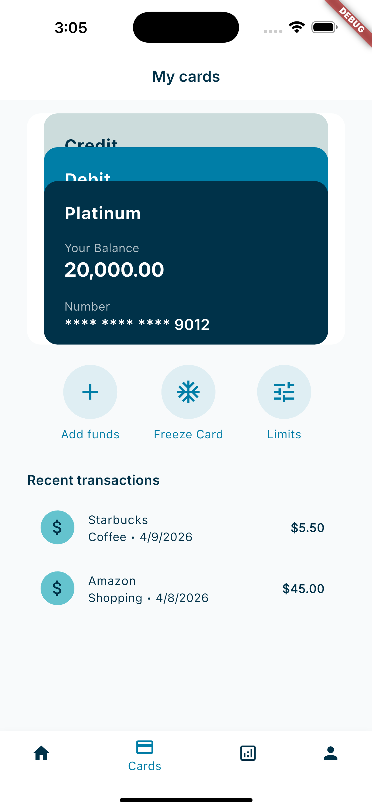
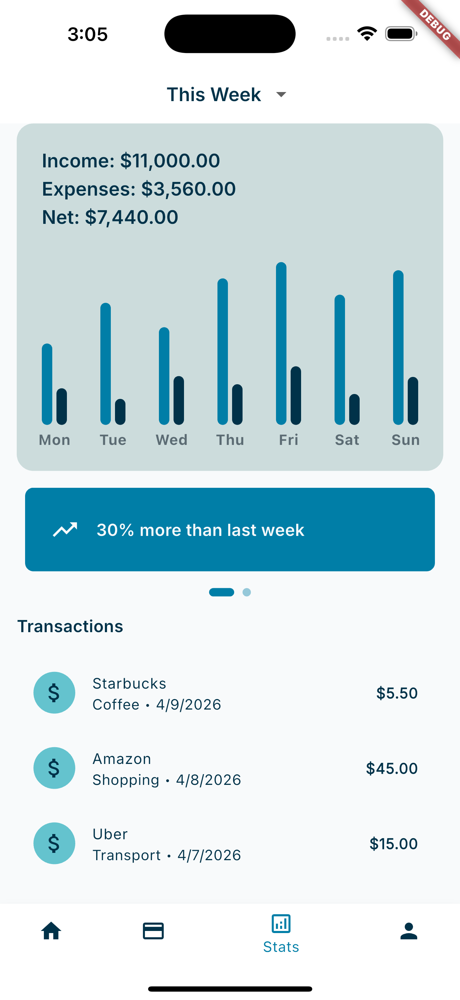

# FinTech+

## 📱 Overview

A Flutter-based mobile banking application prototype showcasing modern fintech UX, feature-based architecture, BLoC state management, repository pattern, and polished loading / error / empty states.

## ✨ Features

- Dashboard overview
- Expense analysis with charts
- Card management
- Transfer flow
- Loading / empty / error states
- Micro-interactions and transitions

## 📸 Screenshots

| Login | Dashboard | Cards | Stats |
|-------|-----------|-------|-------|
|  |  |  |  |

## 🧱 Architecture

- BLoC for feature-level state management
- Repository pattern for data abstraction
- Feature-based folder structure
- Reusable design tokens

## 🛠️ Tech Stack

- Flutter
- Dart
- flutter_bloc
- Repository Pattern

## 🚀 Basic Run Steps

1. **Install Flutter** — Make sure [Flutter](https://flutter.dev/docs/get-started/install) is installed and in your PATH.

2. **Get dependencies**
   ```bash
   flutter pub get
   ```

3. **Run the app**
   ```bash
   flutter run
   ```

4. **Build for production**
   ```bash
   flutter build apk      # Android
   flutter build ios      # iOS
   ```
